# User Management System - Component Flows and Architecture

## 🏗️ System Overview

The Fleet Controller user management system is a sophisticated multi-tenant enterprise authentication platform built on microservices architecture. It combines Ory Kratos for identity management, Ory Hydra for OAuth2/OIDC, PostgreSQL for data persistence, and a custom querier service as the main API gateway.

### Core Components

| Component | Purpose | Port | Technology |
|-----------|---------|------|------------|
| **Traefik Proxy** | Reverse proxy and load balancer | 80, 443, 8080 | Traefik v3.4.1 |
| **Ory Kratos** | Identity and user management | 4433-4434 | Kratos v1.3.1 |
| **Ory Hydra** | OAuth2/OIDC authorization server | 4444-4445 | Hydra v2.3.0 |
| **Querier Service** | Main API gateway and business logic | 1234 | Go |
| **PostgreSQL** | Primary data store | 5432 | PostgreSQL 17 |
| **Frontend** | React-based web application | 5432 | React + Vite |

## 🔄 Complete User Registration Flow

### Phase 1: Registration Initiation

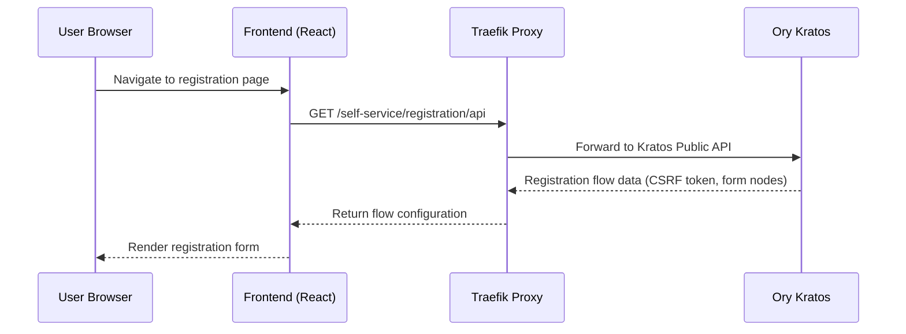

**What happens:**
1. User navigates to registration page in the frontend
2. Frontend calls Kratos to initialize a registration flow
3. Kratos generates a flow with CSRF tokens and form configuration
4. Frontend renders a dynamic form based on Kratos flow data

### Phase 2: Registration Submission

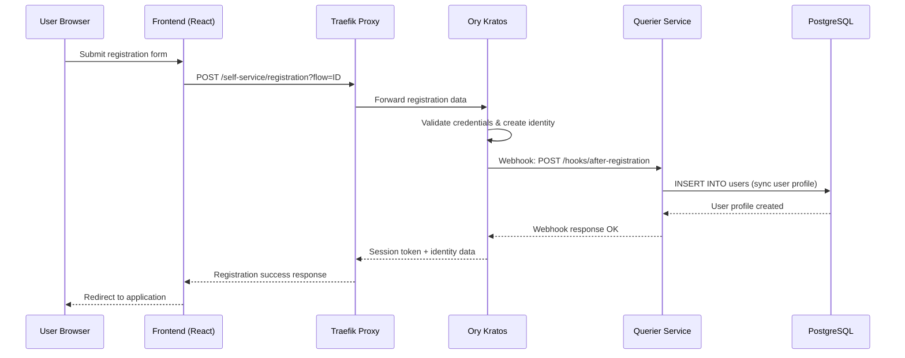

**What happens:**
1. User submits the registration form with email, password, and profile data
2. Kratos validates the data and creates an identity in its database
3. **Critical:** Kratos immediately fires a webhook to `/hooks/after-registration`
4. Querier receives the webhook and syncs user data to the main PostgreSQL database
5. User profile is stored with permissions (e.g., `can_create_organizations = true`)
6. Kratos creates a session and returns a session token
7. User is now registered and authenticated

### Phase 3: Email Verification (Optional)

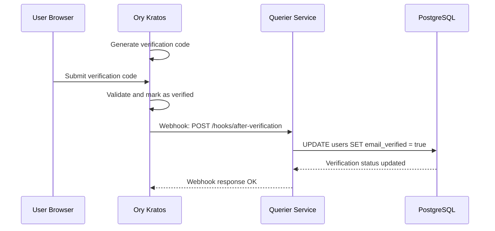

## 🔐 Authentication Flow

### Session-Based Authentication

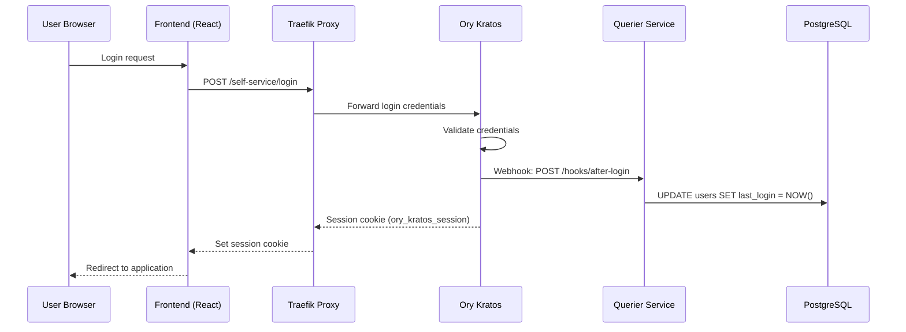

### API Request Authentication

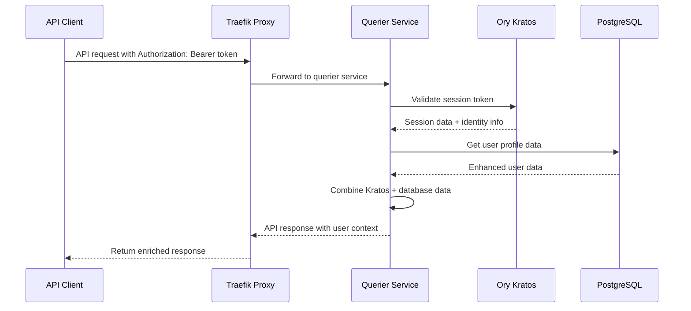

## 🏢 Organization Management Flow

### Organization Creation

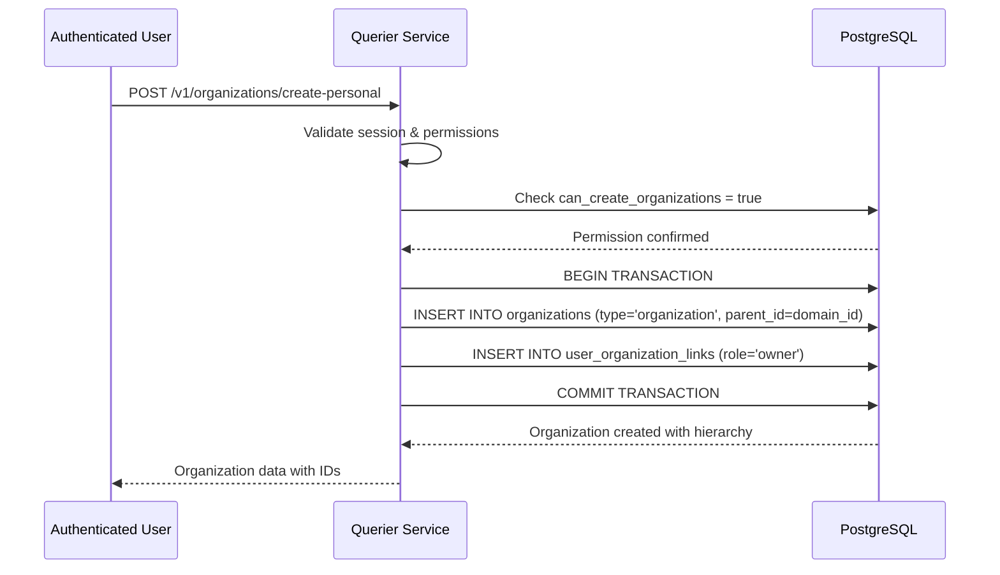

**Hierarchy Enforcement:**
- **Domain** (top-level) → **Organization** → **Tenant**
- Database triggers enforce: Organizations must have domain parents, Tenants must have organization parents
- Users get `owner` role in organizations they create

### Tenant Creation

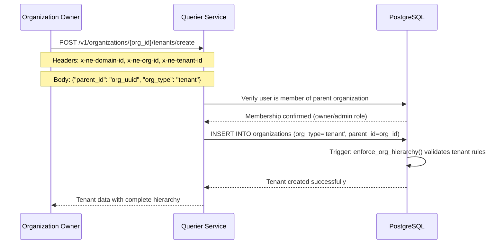

### Member Management

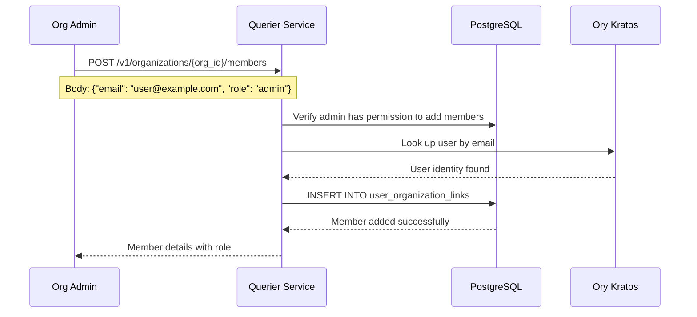

## 🔄 OAuth2 Machine-to-Machine Flow

### M2M Client Creation

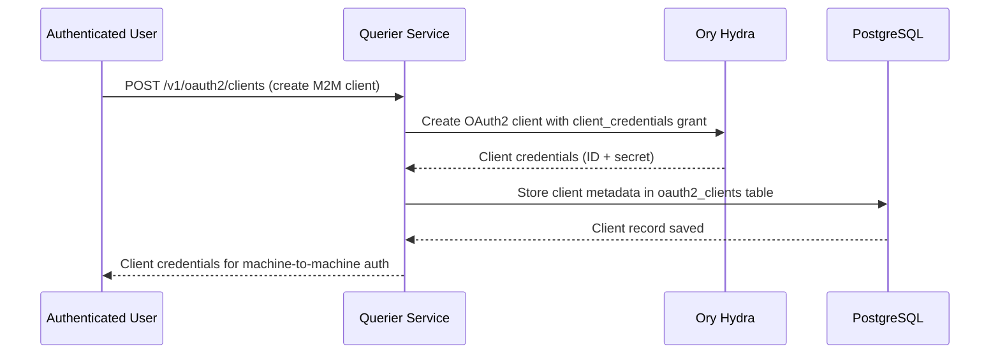

### M2M Token Generation and Validation

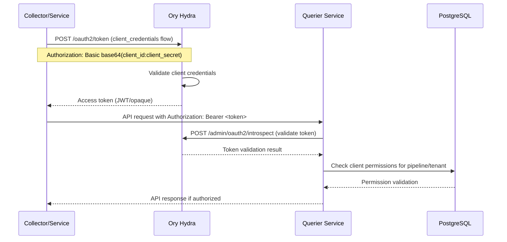

## 💾 Data Storage Architecture

### Kratos Database (Identity Management)
```sql
-- Managed by Ory Kratos
identities (
    id uuid PRIMARY KEY,
    traits jsonb,           -- User profile data
    created_at timestamp,
    updated_at timestamp
);

verifiable_addresses (
    id uuid PRIMARY KEY,
    identity_id uuid,
    value varchar,          -- Email address
    verified boolean,
    via varchar            -- Verification method
);

sessions (
    id uuid PRIMARY KEY,
    identity_id uuid,
    active boolean,
    expires_at timestamp
);
```

### Main Application Database (ADL)
```sql
-- User profiles with enhanced data
users (
    id uuid PRIMARY KEY,                    -- Same as Kratos identity.id
    email varchar(1024) UNIQUE,
    first_name varchar(1024),
    last_name varchar(1024), 
    can_create_organizations boolean,        -- Permission system
    email_verified boolean,                  -- Synced from Kratos
    traits jsonb,                           -- Copy of Kratos traits
    last_login timestamptz,                 -- Updated via webhooks
    last_logout timestamptz
);

-- Hierarchical organization structure
organizations (
    id uuid PRIMARY KEY,
    domain_id uuid,                         -- Reference to domain level
    org_id uuid,                           -- Reference to organization level  
    parent_id uuid,                        -- Hierarchy relationship
    org_type ENUM('domain', 'organization', 'tenant'),
    name varchar(1024),
    owner_id uuid REFERENCES users(id),
    CONSTRAINT organizations_name_parent_unique UNIQUE (name, parent_id)
);

-- Many-to-many user-organization relationships
user_organization_links (
    user_id uuid REFERENCES users(id),
    organization_id uuid REFERENCES organizations(id),
    role varchar(50),                      -- 'owner', 'admin', 'member'
    joined_at timestamptz,
    PRIMARY KEY (user_id, organization_id)
);

-- OAuth2 M2M client management
oauth2_clients (
    id uuid PRIMARY KEY,
    client_id varchar(1024) UNIQUE,
    client_secret varchar(1024),           -- Encrypted in production
    user_id uuid REFERENCES users(id),     -- Client owner
    org_id uuid REFERENCES organizations(id),
    name varchar(1024),
    scopes varchar(1024),
    is_active boolean
);
```

## 🌐 Network and Routing Architecture

### Traefik Proxy Layer
```yaml
# Service routing configuration
Routes:
  - Rule: "PathPrefix(/self-service) || PathPrefix(/sessions)"
    Service: kratos-public (port 4433)
    
  - Rule: "PathPrefix(/v1/) && !PathPrefix(/v1/opamp)"  
    Service: querier (port 1234)
    
  - Rule: "PathPrefix(/)"
    Service: frontend (port 5432)
    
  - Rule: "PathPrefix(/v1/opamp)"
    Service: control-plane (port 1001)
```

### Multi-Tenant Context Headers
All organization and tenant operations require these headers:
```http
x-ne-domain-id: {domain_uuid}      # Top-level domain context
x-ne-org-id: {organization_uuid}   # Organization context  
x-ne-tenant-id: {tenant_uuid}      # Workspace/tenant context
```

The tenant middleware extracts and validates these headers, adding tenant context to all requests.

## 🔗 Component Communication Patterns

### Synchronous Communication
- **Frontend ↔ Querier**: REST API calls for all business operations
- **Querier ↔ Kratos**: Session validation and user data retrieval
- **Querier ↔ Hydra**: OAuth2 client management and token validation
- **Querier ↔ Database**: All persistent data operations

### Asynchronous Communication  
- **Kratos → Querier**: Webhooks for registration, login, verification events
- **Control Plane ↔ Querier**: NATS messaging for collector management

### Webhook Integration Points
```yaml
Kratos Webhooks:
  after-registration: /hooks/after-registration
  after-login: /hooks/after-login  
  after-verification: /hooks/after-verification
  
Webhook Payload:
  identity: {kratos_identity_object}
  flow: {flow_context}
```

## 🔒 Security and Session Management

### Session Types
1. **Browser Sessions**: Kratos-managed cookies (`ory_kratos_session`)
2. **API Sessions**: Bearer tokens (`ory_st_*` format)  
3. **M2M Sessions**: OAuth2 access tokens (JWT/opaque)

### Authentication Priority
```go
// Querier authentication check order
1. Check Authorization header (Bearer token)
2. Check session cookies (ory_kratos_session)
3. Validate against Kratos session endpoint
4. Enrich with database user profile data
```

### Permission Model
```yaml
User Permissions:
  - can_create_organizations: boolean
  
Organization Roles:
  - owner: Full control, can promote others to owner
  - admin: Manage members, cannot promote to owner
  - member: Basic access, view-only

Tenant Access:
  - Inherited from organization membership
  - Requires valid tenant context headers
```

## 🚀 Service Startup Dependencies

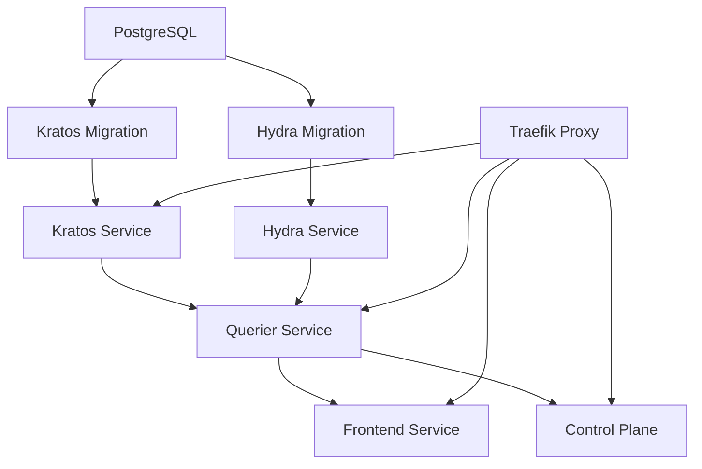

## 🔄 Complete Request Lifecycle

### User Registration → Organization Creation → Tenant Creation

1. **Registration**: User registers → Kratos webhook → Database sync → User can login
2. **Permission Grant**: Admin sets `can_create_organizations = true` in database
3. **Organization Creation**: User creates organization → Becomes owner → Can manage members
4. **Tenant Creation**: Organization owner creates tenant → Hierarchical structure maintained
5. **Member Management**: Owner/admin adds members → Role-based access control applied
6. **API Access**: All operations require session + tenant context headers

This architecture provides enterprise-grade multi-tenancy with proper security, scalability, and maintainability. The separation of identity management (Kratos) from business logic (Querier) allows for flexible authentication methods while maintaining consistent authorization and data access patterns. 
